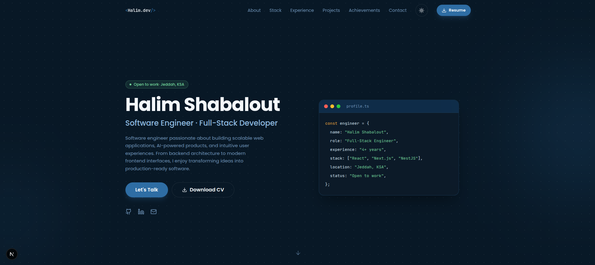

# Halim Shabalout Portfolio

## 🌐 Live Demo

https://halim-portfolio.vercel.app/

Personal portfolio site built with Next.js 16 (App Router), React 19, TypeScript, Tailwind CSS v4, Framer Motion, and shadcn/ui-style components.



## Tech Stack

- Next.js 16
- React 19
- TypeScript
- Tailwind CSS v4
- Framer Motion
- Lucide Icons
- next-themes

## Features

- 🏠 Hero with a strong one-line pitch + animated terminal card
- 👨‍💻 About (summary, education, languages)
- 🛠 Tech Stack, grouped by category
- 🚀 Featured projects with live demos and production-ready case studies.
- 🏆 Achievements
- 💼 Experience timeline
- 📄 Download CV button (Navbar + Hero)
- 📬 Contact section
- 🌙 Dark / Light mode toggle (persisted, respects system preference by default is dark)
- ✨ Scroll-reveal and stagger animations via Framer Motion
- 📱 Fully responsive, from mobile to desktop

## Structure

- `app/` — root layout, global theme tokens (`globals.css`), the page route
- `components/` — one file per section (Navbar, Hero, About, TechStack, Experience, Projects, Achievements, Contact, Footer)
- `components/ui/` — shadcn-style primitives (Button, Card, Badge) built on `class-variance-authority` + `tailwind-merge`
- `components/theme-provider.tsx` / `theme-toggle.tsx` — dark/light mode via `next-themes`
- `components/Reveal.tsx` — reusable scroll-triggered animation wrapper (Framer Motion)
- `lib/data.ts` — **all editable content** (name, summary, skills, experience, projects, achievements). Edit this file to update any text on the site — no need to touch components.
- `public/Halim_Shabalout_CV.pdf` — served by the "Download CV" / "Resume" buttons. Replace this file whenever the CV is updated (keep the same filename).

## Getting Started

```bash
npm install
npm run dev
```

Open http://localhost:3000.

## Deploy

Push to GitHub and import the repo on [Vercel](https://vercel.com/new) — Deploy instantly on Vercel with zero configuration. Vercel automatically detects the Next.js framework.

## Notes

- Fonts (Poppins, JetBrains Mono) load from Google Fonts at runtime via a `<link>` tag in `app/layout.tsx`.
- The terminal/code card in the Hero is intentionally always dark in both themes — it's the site's signature visual element.
- Add an `href` for Imaginov in `lib/data.ts` once it has a public URL.


## Author

**Halim Shabalout**

- GitHub: https://github.com/halimShabalout
- LinkedIn: https://www.linkedin.com/in/halim-shabalout-372a24215/